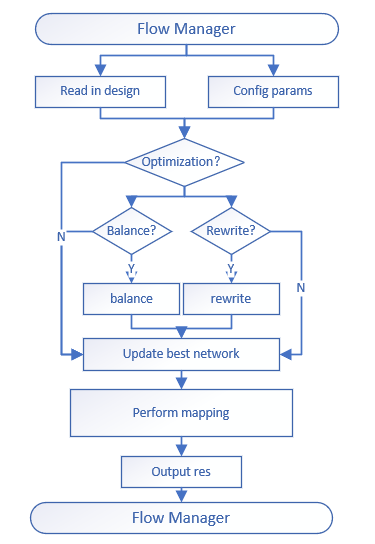

# FPGA_map_tool --doc
```markdown
this is the document lists of out main works.
you can find the detail documents in the **/doc/descriptions** folder.
```
### **lists:**
- [the whole flow](descriptions/flow-manager.md)
  
  


