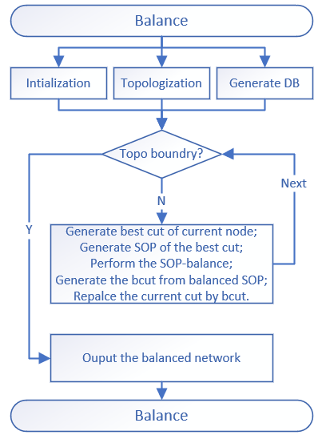

### **balance_online_impl**
```markdown
the balance method of optimization is mainly focus on the SOP-based balance. 
for each node we calculate the lower delay cut as the best cut, then we generate the SOP of this cut. 
so we perform the balance on SOP to get a more balanced SOP formular, then we transform the balanced SOP to subgraph to replace the current cut.
```


- **Examples**
  ```c++
    using namespace ifpga;
    using namespace ifpga::detail;
    aig_network aig;
    balance_params ps;
    node_resynthesis resyn;
    network_cuts cut_network(aig.size());
    rewrite_online_impl p(aig, cut_network, ps, resyn);
    aig_network res = p.run();
  ```

- **Main APIs**
  - **void run()**;
  ```markdown
    1. function: the public function for external call. the main process is depicted as above.
    2. params  : none.
    3. return  : none.
  ```
