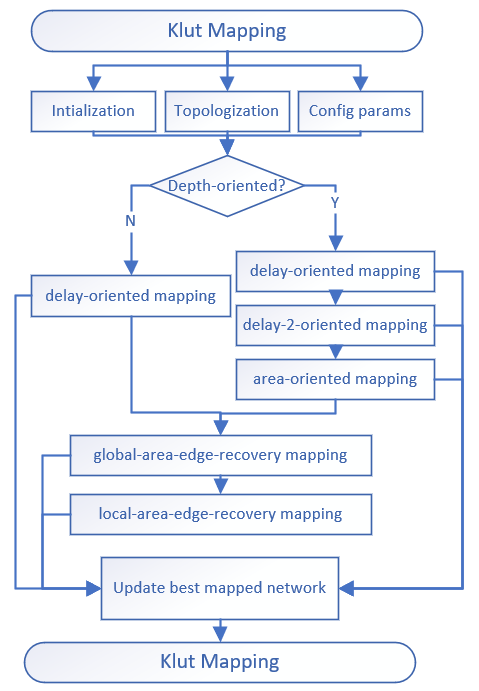

### **klut_mapping_impl**
```markdown
the main FPGA mapping algorithms.
we main refer to [wiremap](https://dl.acm.org/doi/10.1145/1534916.1534924)
```



- **Examples**
  ```c++
    using namespace ifpga;
    using namespace ifpga::detail;
    aig_network aig;
    klut_mapping_params ps;
    klut_mapping_stats st;
    klut_mapping_impl kmi(aig, ps, st);
    kmi.run();
  ```

- **Main APIs**
  - **klut_mapping_impl(Ntk& ntk, klut_mapping_params const& ps, klut_mapping_stats& st)**;
  ```markdown
    1. function: the constructor function,
    2. params  : 
      ntk: the reference of the input network.
      ps : the config params of klut_mapping flows.
      st : the status of the mapping process.
    3. return  : none.
  ```
  - **void run()**;
  ```markdown
    1. function: the public function for external call, it mainly about the initialization, and mapping flows.
    2. params  : none.
    3. return  : none.
  ```
  - **void mapping_rounds()**;
  ```markdown
    1. function: the main mapping flow of klut_mapping algorithm.
    2. params  : none.
    3. return  : none.
  ```
  - **void initialize()**;
  ```markdown
    1. function: initialize the internal variables, so we can directly get the values once computed.
    2. params  : none.
    3. return  : none.
  ```
  - **void topologize()**;
  ```markdown
    1. function: the DFS topologization function, then we could perform area covery from POs to PIs following the topo-order.
    2. params  : none.
    3. return  : none.
  ```
  - **void cut_delay()**;
  - **void cut_area()**;
  - **void cut_edge()**;
  - **void cut_area_flow()**;
  - **void cut_edge_flow()**;
  ```markdown
    cut_area is releated to the input num of the cut, we set to 1 if input_num >= 2, otherwise 0.
    the 5 functions above refer to the equations of the following:
  ```
  $$
  Delay(n) = 1 + \mathop{\arg\max_{delay}} ( Delay(Leaf_i(n)) )
  \\
  Edge(n) = Size(cut) + \sum_i numFanins(Leaf_i(n))
  \\
  AreaFlow(n) = \cfrac {Area(n) + \sum_i AreaFlow(Leaf_i(n))}{NumFanouts(n)}
  \\
  EdgeFlow(n) = \cfrac {Edge(n) + \sum_i EdgeFlow(Leaf_i(n))}{NumFanouts(n)}
  $$

  - **void mapping_depth_oriented(int mode)**;
  ```markdown
    1. function: the depth-oriented mapping algorithm.
    2. params  :
      mode: 0 for depth-oriented mapping;
            1 for depth-2-oriented mapping;
            2 for area-oriented mapping; 
    3. return  : none.
  ```
  - **void global_area_edge_recovery()**;
  ```markdown
    1. function: the area/edge-flow-oriented mapping algorithms based on the global area/edge recovery.
    2. params  : none.
    3. return  : none.
  ```
  - **void local_area_edge_recovery()**;
  ```markdown
    1. function: the area/edge-oriented mapping algorithms based on the local area/edge recovery.
    2. params  : none.
    3. return  : none.
  ```
  - **void update_best_network(  mapping_qor_storage qor, bool first = false)**;
  ```markdown
    1. function: update the best nework by compare the dot product of the area and delay. the value of area*delay is more lower more better.
    2. params  :
      qor  : the mapped result with area and delay.  
      first: flag for whether is the first update.
    3. return  : none.
  ```
  - **void derive_final_mapping()**;
  ```markdown
    1. function: cover the network from POs to PIs by the best cut of each node. then we will get a covered network to klut_network, and we compute the area and delay meanwhile. 
    2. params  : none.
    3. return  : none.
  ```