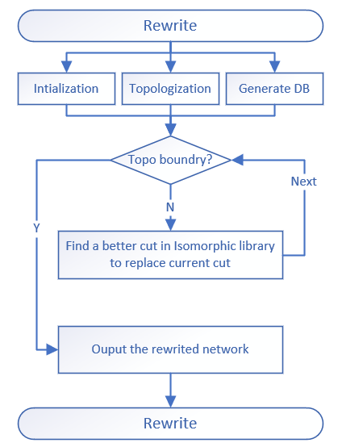

### **rewrite_online_impl**
```markdown
the rewrite method of optimization is mainly focus on better cut alternative from the pre-computed  isomorphic library based on 4-inputs-cut. 
so we can get a better area or depth optimized network by rewrite.
```
#### **node_resynthesis**
```markdown
there are 222 NPN classes for 4-inputs Boolean formutation, 
so we generate the database for these 222 NPN classes in a subgraph library, 
then we could get the map file to replace the cut by a better isomorphic cut. 
```


- **Examples**
  ```c++
    using namespace ifpga;
    using namespace ifpga::detail;
    aig_network aig;
    rewrite_params ps;
    node_resynthesis resyn;
    network_cuts cut_network(aig.size());
    rewrite_online_impl p(aig, cut_network, ps, resyn);
    aig_network res = p.run();
  ```

- **Main APIs**
  - **void run()**;
  ```markdown
    1. function: the public function for external call. the main rewrite method based on 4-inputs-cut. we replace the current 4-inputs-cut by a better cut from the isomorphic library by the topo-order.
    2. params  : none.
    3. return  : none.
  ```
